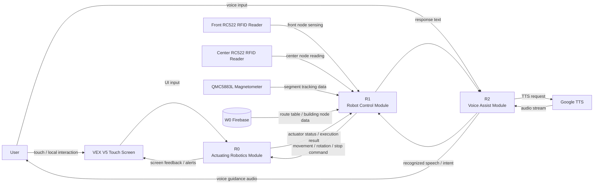
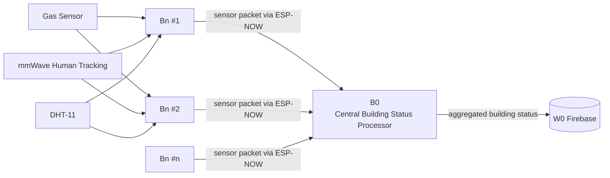

Project FORCE System

Address Info :
ESP32	MAC Address
R0		
R1
R2
B0
B1
B2

W0 REST API URL : 

- EVAC Guide Robot [R0, R1, R2]

    R0 Actuating Robotics Module Powered by VEX V5
    - > Connect with R1 via UART over RS485
    - > Connect with R2 via UART over RS485
    - > V5 Smart Motor 11W * 2EA
    - > Human UI via VEX V5 touch screen
    Smart Port Info
    0 : 

    R1 Robot Control Module Powered by ESP32 S3 [Arduino Nano ESP32]
    - > Connect with W0 via HTTP over WiFi
    - > Connect with R0 via UART over TTL
    - > Node Sensing via Front RC522 RFID Reader
    - > Node Reading and rotating via Center RC522 RFID Reader
    - > Segment Tracking via QMC5883L 3-axis Magnetometer 
    GPIO Port Info
    0 : 

    R2 Robot Voice Assist Module Powered by ESP32 S3 [Seeed XIAO S3 Sense]
    - > Connect with R0 via UART over TTL
    - > Speech Recognition with ESP-SR via embedded mic on Seeed XIAO S3 Sense
    - > Text to speech with google TTS streaming via ESP32 wifi
    - > Speaker output with MAX98357A amplifier via I2S

- Building Monitoring System [B0, Bn]

    B0 Central Building Status Processor Powered by ESP32 S3 [Arduino Nano ESP32]
    - > Connect with W0 via HTTP over WiFi 
    - > Connect with Bn via ESP-NOW over WiFi
    
    Bn Peripheral Building Special Node Sensor by ESP32 S3 [Arduino Nano ESP32]
    - > Connect with B0 via ESP-NOW over WiFi
    - > Gas Sensor
    - > mmWave Human Tracking Sensor
    - > DHT-11

    Node Block Embedded NTAG215 RFID Card-Key
    - > has azimuth of branches to go 

    Segment Block Embedded Magnetic Guide Rail

- Building Information Mirroring System [W0]

    W0 Building Node and Segment Table Powered by Firebase
    - > 

## Mermaid DFD

### EVAC Guide Robot

### Building Monitoring System

